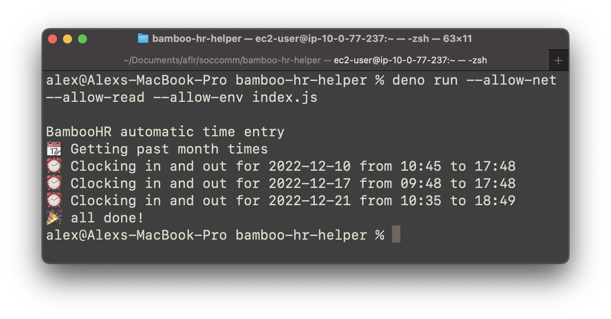
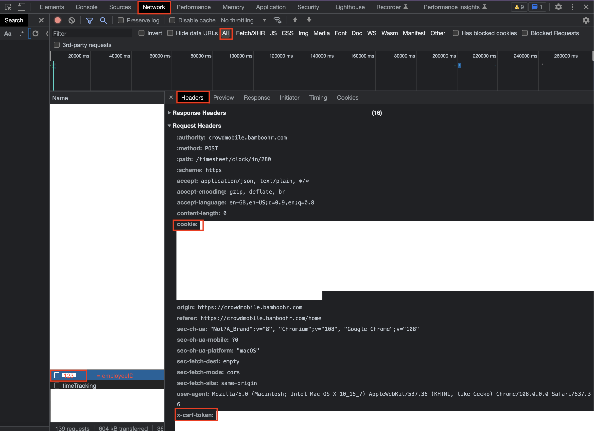

# BambooHR automatic time entry



This tool alows you to automatically clock-in and out during the current paying period (current month).

**Note**: we can't clock in-out for past paying periods (bamboohr rules)

## How it works

This tool will get your time entry data for the current period and perform a number of checks on every day:

- is it a public holiday?
- is it a personal day off?
- is it on a weekend?
- is it later than today?
- are there any existing time entries?

If all of this checks are false, it means we can add a time entry.

The software generates random start and end hours using `Math.random`. This times:

- start between 9:00 and 10:59
- end between 17:00 and 18:59

If used across all month, the average hours per day are 8, even though any given day can oscillate between 6 and 10 hours. Feel free to edit the randomizer algorithm so random times match your desired schedule better.

## Usage

### requirements

You will need to have deno installed. Check [this page](https://deno.land/manual@v1.29.1/getting_started/installation) for instructions.

### clone the repo

```
git clone https://github.com/a96lex/bamboo-hr-helper.git
```

or

```
git clone git@github.com:a96lex/bamboo-hr-helper.git
```

### environment variables

Create and fill a `.env` file, following the given `.env.example` file

To find the `.env` variables:

- Go to BambooHR and open the network tab.
- perform a POST request (for example, add a time entry)
- check the request headers. There you will find the `Cookie`, `X-CSRF-TOKEN` and `User-Agent` headers. Put the values in your `.env`
- check the request body. In there you will find the `employeeID` field. Put the value in your `.env`



**Note**: I do not know when do this variables expire. If something does not work, you may need to get them again.

### running the software

from the root of the project, run:

```
deno run --allow-net --allow-read --allow-env index.js
```

That's it, enjoy your new free time!
